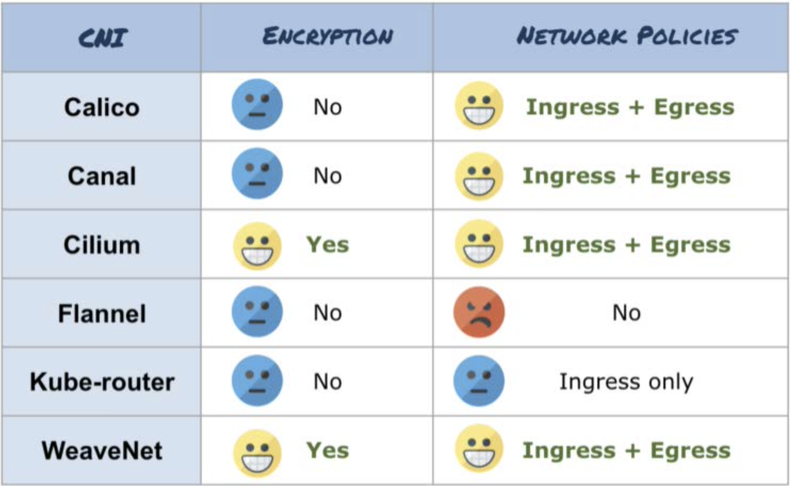
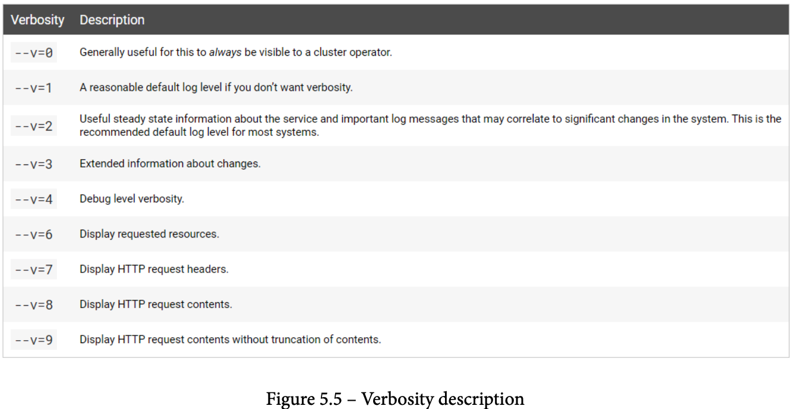

# Kubernetes

# Audit
Kubeadit sample

```
$ curl -sLf -o kubeaudit.tar.gz https://github.com/Shopify/kubeaudit/releases/download/v0.7.0/kubeaudit_0.7.0_linux_amd64.tar.gz

$ tar -zxvf kubeaudit.tar.gz

$ chmod +x kubeaudit

$ ./kubeaudit nonroot -f deployment.yaml &> errors

$ if [ -s errors ] ; then cat errors; exit -1; fi
```

# Access Control Types
> Discretionary access control (DAC)—With DAC models, the data owner decides on access. DAC is a means of assigning access rights based on rules that users specify.


> Mandatory access control (MAC)—MAC was developed using a nondiscretionary model, in which people are granted access based on an information clearance. MAC is a policy in which access rights are assigned based on regulations from a central authority.


> Role-based access control (RBAC)—RBAC grants access based on a user’s role and
implements key security principles, such as least privilege and separation of privilege. Thus, someone attempting to access information can only access data deemed necessary for their role.

> Attribute-based access control (ABAC)—ABAC, also known as policy-based access control, defines an access control paradigm whereby access rights are granted to users through the use of policies that combine attributes together.

# Signing Docker
```export DOCKER_CONTENT_TRUST=1```

# CNI



# Metrics Server
```
$ kubectl apply -f https://github.com/kubernetes-sigs/metrics-server/releases/download/v0.5.2/components.yaml
```

<code>
Try adding --kubelet-insecure-tls

kubectl edit deploy metrics-server -n kube-system

      containers:
      - args:
        - --cert-dir=/tmp
        - --secure-port=8448
        - --kubelet-preferred-address-types=InternalIP,ExternalIP,Hostname
        - --kubelet-insecure-tls
</code>

# Dashboard
```
$ kubectl apply -f https://raw.githubusercontent.com/kubernetes/dashboard/v2.4.0/aio/deploy/recommended.yaml
```

<code>
 http://localhost:8001/api/v1/namespaces/kubernetes-dashboard/services/https:kubernetes-dashboard:/proxy/
</code>

# Prompt:
```
$ export PS1='❯❯❯  '
```