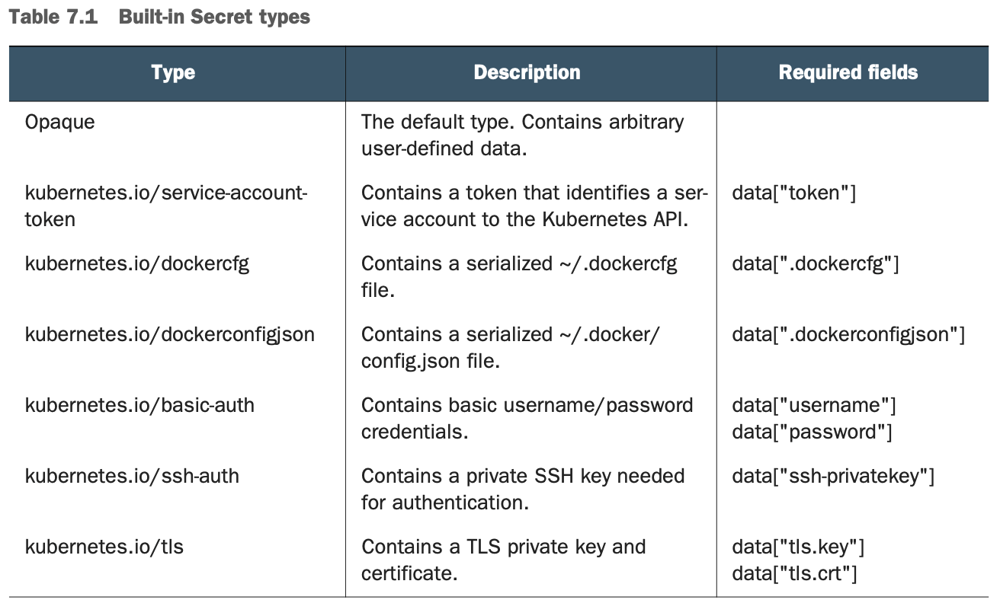
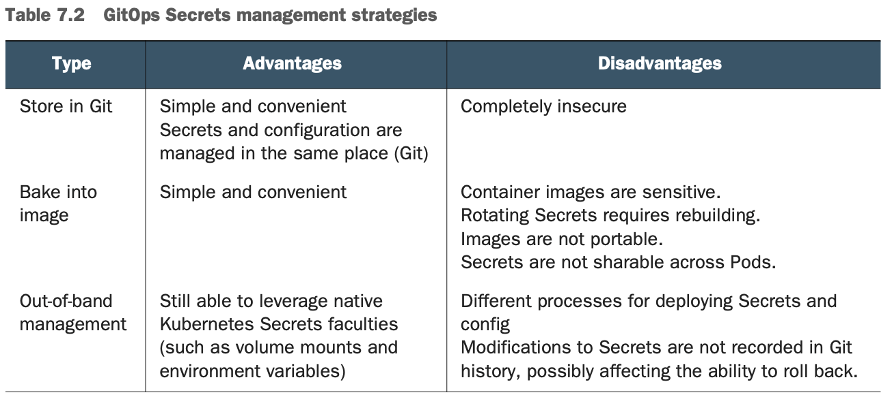

# GitOps

# Utils
outputs the images of all deployments in the Namespace:


```
$ kubectl get deploy -o wide | awk '{print $1,$8}' | column -t 
```
<table>
  <tr>
    <th>NAME</th><th>IMAGES</th>
  </tr>
  <tr>
    <td>sample-app</td><td>gitopsbook/sample-app:508d3df</td>
  </tr>
</table>

## Restart
Force update even if the image tag is the same

```
$ kubectl rollout restart <deployment-name>
```

 # Decoding K8S Secrets
 ```
 $ kubectl get secret my-secret -o=jsonpath='{.data.password}' | base64 --decode
 ```
  
  

 # Tracing
 ```
 $ kubectl apply -f https://raw.githubusercontent.com/gitopsbook/resources/master/chapter-08/jaeger/jaeger-all-in-one.yaml
 ```