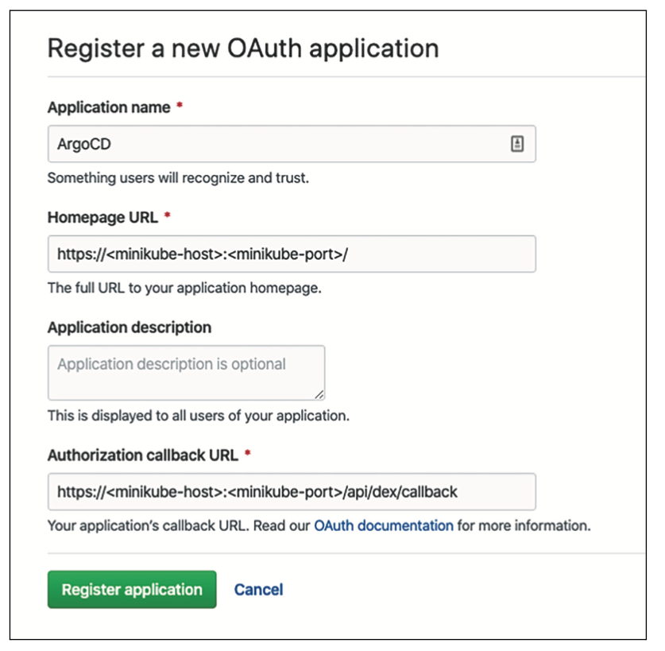
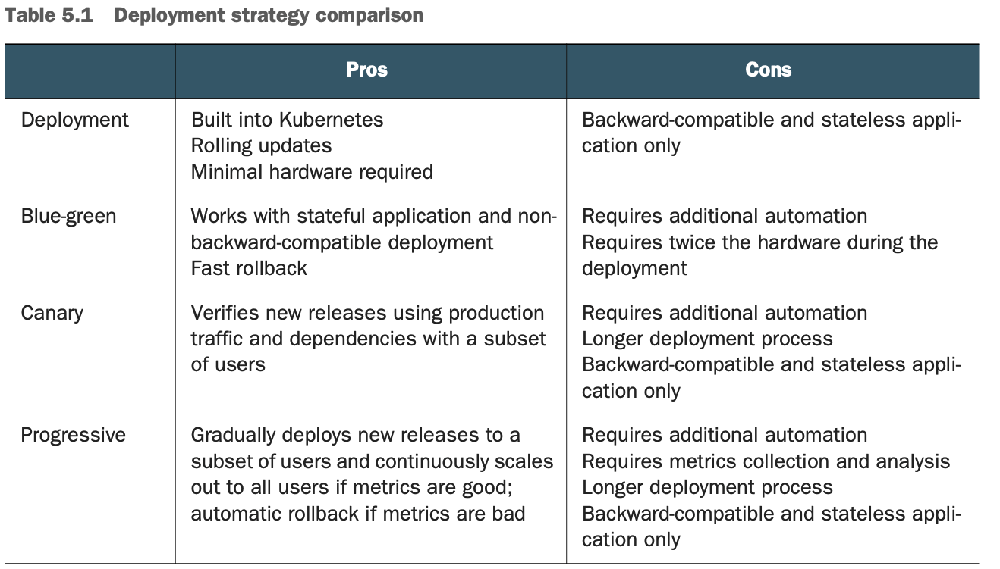
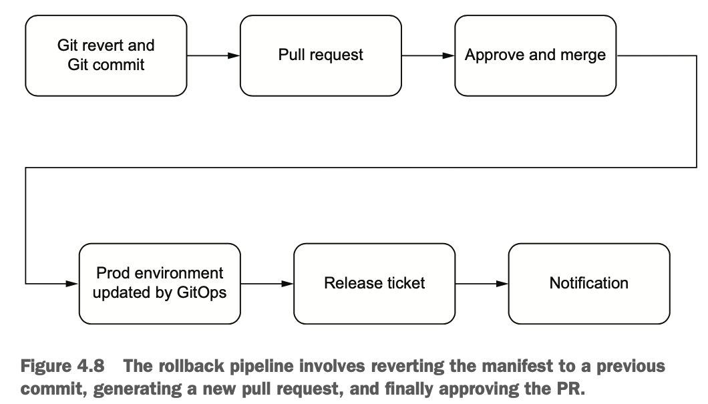
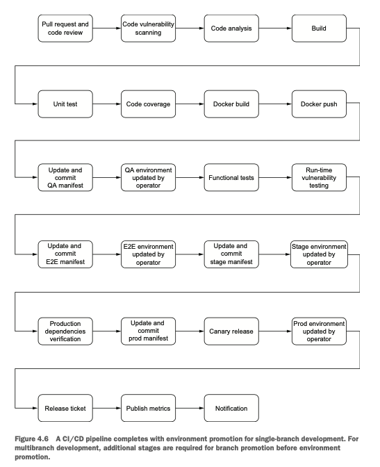
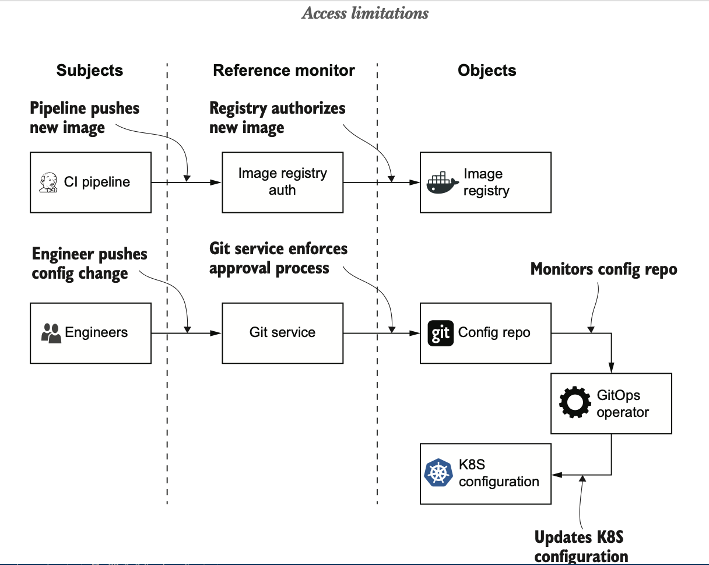

# ArgoCD


## Setup
```shell
$ export ARGOCD_NAMESPACE=argocd
$ kubectl create namespace $ARGOCD_NAMESPACE

$ kubectl apply -n $ARGOCD_NAMESPACE -f https://raw.githubusercontent.com/argoproj/argo-cd/stable/manifests/install.yaml

# For Node Port
$ kubectl patch svc argocd-server -n $ARGOCD_NAMESPACE -p '{"spec": {"type": "NodePort"}}'

$ kubectl -n $ARGOCD_NAMESPACE get secret argocd-initial-admin-secret -o jsonpath="{.data.password}" | base64 -d

```

### Password Update
```shell
$ curl -sSL -o /usr/local/bin/argocd https://github.com/argoproj/argo-cd/releases/latest/download/argocd-linux-amd64

$ chmod +x /usr/local/bin/argocd

$ argocd login <server-ip>:<port>

username: admin
password: <secret>

$ argocd account update-password
```

# ArgoCD Managing ArgoCD
```
$ argocd app create argocd \
--repo https://github.com/paulokinjo/kubernetes.git \ --path argocd \
--dest-server https://kubernetes.default.svc \ --dest-namespace argocd \
--sync-policy auto
application 'argocd' created

```

# Security
Some considerations that factor into the security of components include

> Potential attack vectors

> Worst-case consequences if the component becomes compromised > Who should be allowed access to the service

> What permissions (RBAC) various users have

> What protections can be put in place to mitigate risk

# Creating an Application (CLI)
```
$ argocd app create prometheus \
  --repo https://github.com/paulokinjo/prometheus \
  --path ./k8s \
  --dest-server https://kubernetes.default.svc \
  --dest-namespace monitoring
```

# Github Auth Example


# References



